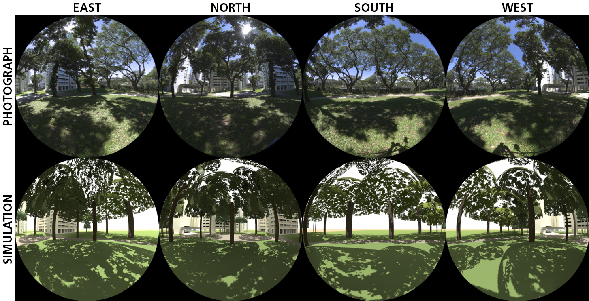

# gen_tree
A program to generate simple tree models for lighting simulations based on gap fraction measurements and tree shape &amp; dimension.

## Terms of use
The code is licensed under GNU. For use of the code in research, kindly cite our associated publication [Measuring light through trees for daylight simulations: a photographic and photometric method.](https://scholar.google.com/scholar?cluster=3635521680530490059&hl=en&oi=scholarr)

## Features
Generate tree crown models based on four shapes:
- Hemisphere
- Truncated ellipsoids (Prolate and Oblate ellipsoids)
- Truncated cones

## Contents
All code is provided in the [gen_tree](gen_tree) folder.
- [Library file](gen_tree/lib.py)
- [Main file with example runs](gen_tree/main.py)

## Dependencies

- Python `>= 2.7`
- Numpy/Scipy

## How to use
1. Download the code using `git clone https://github.com/C38C/gen_tree.git` on the command line/Terminal.
2. Run main file with `python main.py`, using the necessary generating function in the file for the desired shape (`gen<shape_name>`).
3. Results are stored in an `output/` folder that contains:
    - A `<shape_name>.obj` file, for use with any 3D CAD program (e.g., Rhino),
    - A `<shape_name>.rad` file for Radiance,
    - A `<shape_name>PointCloud.csv` file with the initial vertices coordinates.

## Getting started
The code has some default values to generate a tree crown model in the shape of a hemisphere, truncated cone, ellipsoid prolate and ellipsoid oblate.

To create your own tree you will need:

1. `vertices_count` which determines the number of triangles that make the tree crown model. A good number to start with is 20,000.   

2. `gap_percentage` value, which indicates the transmittance characteristics of the tree crown. If you have a gap percentage of 10% then input the value as 0.1 in the code. Some measured gap percentages of tropical trees are given below. Follow the [published paper](https://scholar.google.com/scholar?cluster=3635521680530490059&hl=en&oi=scholarr) to measure gap percentages of trees.

3. Depending on the shape you decide for the tree crown, you will need either the `radius` or the `radius` and `height` of the crown.

| Common name (scientific name) of tree | Gap Percentage | Tree crown shape |
|-|-|-|
|Sandbox Tree (Hura Crepitan)| 10.7% | Hemisphere|
|Star Apple (Chrysophyllum Cainito L.)| 8.8% |Hemisphere|
|Bornean Rhu (Gymnostoma Nobile)| 17.8% |Cone|
|Rain Tree (Samanea Saman)| 7.4% | Ellipsoid Oblate|
|Red Frangipani Tree (Plumeria Rubra)| 16% | Ellipsoid Prolate / Oblate |

     
Image created in Rhino + Radiance using the tree crown models generated using the code. Above: Photographs of the scene. Below: Rendered images of the scene.
